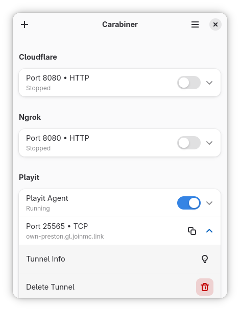
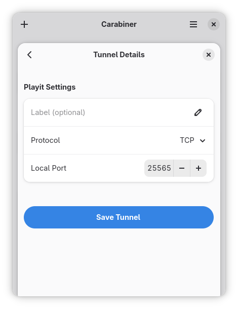

  

<h1 align="center">Carabiner</h1>

  Create and manage network tunnels
    
  
  
  

## Description

Carabiner is an easy-to-use utility for HTTP, UDP, or TCP services.
Share local web servers, game servers, or other network services.

## Features

- Ngrok, Playit, and Cloudflare tunnels
- Simple setup wizards for creating new tunnels
- Live monitoring of tunnel status and details
- Background service support for persistent tunnels

## Install

## Development

You can clone this project and run it using [GNOME Builder](https://apps.gnome.org/Builder/).

## Screenshots

  

  

## License

GPL-3.0-or-later
